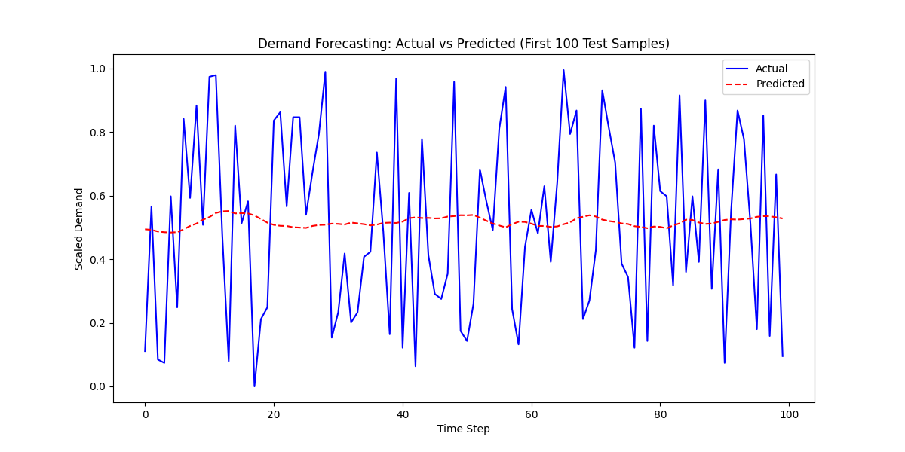

# Supply Chain Demand Forecasting & Optimization System

This project implements a demand forecasting system using Long Short-Term Memory (LSTM) networks to predict future product demand based on historical sales data.

## Features

-   **Synthetic Data Generation**: Generates realistic sales data with trends and seasonality.
-   **LSTM Model**: Deep learning model for time-series forecasting.
-   **Visualization Dashboard**: Streamlit app to visualize historical data and forecasts.

## Model Performance

The model is evaluated using the following metrics on the test set:

| Metric | Value |
| :--- | :--- |
| **MAE** (Mean Absolute Error) | 0.2539 |
| **RMSE** (Root Mean Squared Error) | 0.2918 |
| **R² Score** | -0.0061 |

*(Note: These metrics are from a demonstration run with 5 epochs. For better accuracy, increase epochs in `train.py`)*

### Prediction Visualization


## Setup

1.  Current working directory: `/home/vineet/Desktop/2nd project`
2.  Install dependencies:
    ```bash
    pip install -r requirements.txt
    ```

## Usage

1.  **Generate Data**:
    ```bash
    python src/data_generator.py
    ```
2.  **Train Model**:
    ```bash
    python src/train.py
    ```
3.  **Run Dashboard**:
    ```bash
    streamlit run src/app.py
    ```
